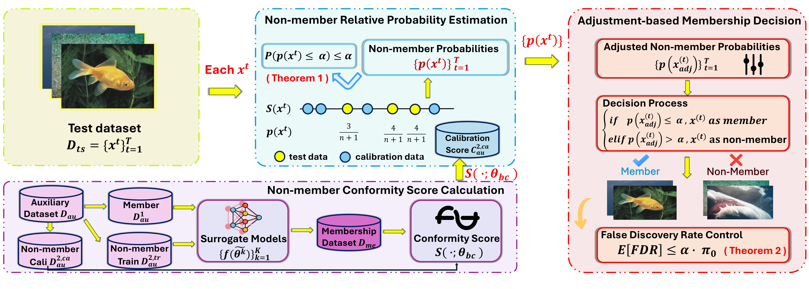

# Membership Inference Attacks with False Discovery Rate Control



## Install

Install the dependencies in a Conda environment:
```
python==3.8.18
pytorch==1.13.1
matplotlib==3.7.4
scikit-learn==1.3.2
pandas==2.0.3
```


## Usage

Run the example command in the main directory to pre-train a model:
```
python pretrain.py -dataset=CIFAR10 -net=ResNet18 -epoch=40 -lr=0.1 -batch_size=128
```

This is a description of the command. For additional parameter settings, please refer to `utils/parser.py`.

- `dataset` dataset
- `net` model architecture
- `epoch` number of training epochs
- `lr` learning rate
- `batch_size` number of batch size


Run the command in the main directory to perform classifier-based MIAFdR:

```
python main_classifier.py -craftproj=cifar10 -dataset=CIFAR10 -net=ResNet18 -epoch=40 -num_shadow=4 -logdir=logs-classifier
```

This is a description of the command. For additional parameter settings, please refer to `utils/parser.py`.

- `craftproj` project name
- `dataset` dataset
- `net` model architecture
- `epoch` number of training epochs
- `num_shadow` number of shadow models
- `logdir` logs directory (the results are saved in log file)


